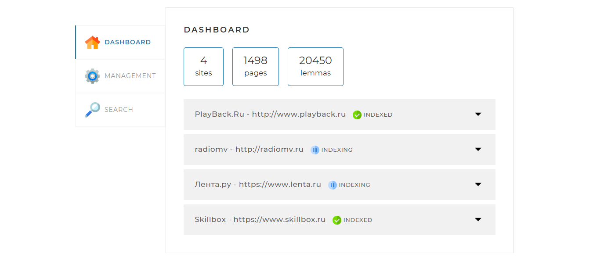
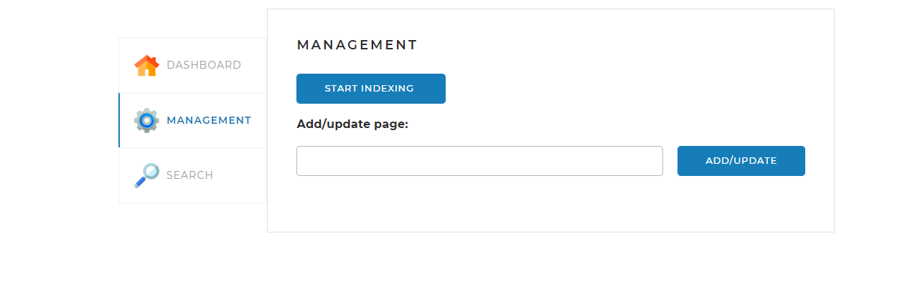
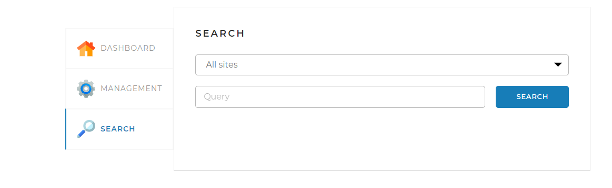

# SearchEngine - локальный поисковый движок


# Описание 


Проект представляет собой Spring-приложение, 
которое реализует поисковый движок. 
Приложение работает с локально установленной базой данных MySQL и имеет веб-интерфейс
и API для управления и получения
результатов поисковой выдачи.


# Основные принципы работы поискового движка:


1. Задаются адреса сайтов, по которым движок должен осуществлять поиск.
2. Поисковый движок самостоятельно обходит все страницы заданных сайтов и создает индекс. Индекс содержит информацию о каждой странице, чтобы потом можно было находить наиболее релевантные страницы по любому поисковому запросу.
3. Пользователь отправляет запрос через API движка. Запрос представляет собой набор слов, по которым нужно найти страницы сайта.
4. Запрос трансформируется в список слов, переведенных в базовую форму (например, для существительных - именительный падеж, единственное число).
5. В индексе ищутся страницы, на которых встречаются все эти слова.
6. Результаты поиска ранжируются, сортируются и отдаются пользователю.

# Используемые технологии:

JPA, JSOUP, Morphology Library Lucene, SQL, 
Spring Framework.


# Веб-страница

_ЛОГИН:_ **root**; _ПАРОЛЬ_: **8324537WoT1997!** 
для входа на веб-страницу по адресу; **_localhost:8080_**.

Страница содержит три вкладки.

# Вкладка DASHBOARD
Эта вкладка открывается по умолчанию. 
На ней отображается общая статистика по всем сайтам, а также детальная статистика
и статус по каждому из сайтов.




# Management

На этой вкладке находятся инструменты 
управления поисковым движком — запуск и остановка полной индексации (переиндексации), а также возможность добавить
(обновить) отдельную страницу по ссылке:




# Search

На этой вкладке находится строка запроса. Для поиска 
можно вводить как одно слово, так и целую фразу.
При этом можно выбирать, где искать -
на конкретном сайте или выбрать все сайты.



В результате поиска выводится список наиболее релевантных страниц, где встречаются слова из строки запроса.


## Для запуска необходимо:

Подключение зависимостей morph, morphology,
dictionary-reader, english, russian 
из источника : org.apache.lucene.morphology
необходимо создать (либо отредактировать
если он имеется - в Windows он располагается
в директории C:/Users/<Имя вашего пользователя>/.m2) файл settings.xml, в котором указать токен для получения данных из публичного репозитория. 
В файл нужно внести следующие строки:


```java
<settings xmlns="http://maven.apache.org/SETTINGS/1.0.0"
        xmlns:xsi="http://www.w3.org/2001/XMLSchema-instance"
        xsi:schemaLocation="http://maven.apache.org/SETTINGS/1.0.0
        https://maven.apache.org/xsd/settings-1.0.0.xsd">

<servers>
    <server>
        <id>skillbox-gitlab</id>
        <configuration>
            <httpHeaders>
                <property>
                  <name>Private-Token</name>
                  <value>wtb5axJDFX9Vm_W1Lexg</value>
                </property>
            </httpHeaders>
        </configuration>
      </server>
    </servers>
</settings>
```